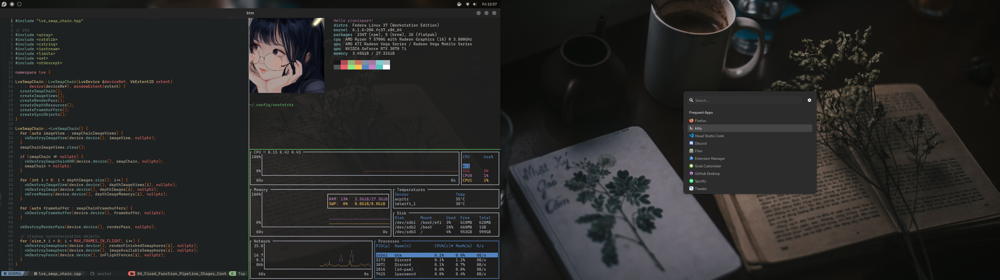

# My Dotfiles

Here you can find:

- Neovim Settings
- Powershell profile.
- Alacritty Settings for Windows.
- Kitty Settings for Linux.
- Neofetch Settings.
- zsh profile.

## Fedora Settings

[Find my Fedora setting here.](./Fedora/README.md)

## Neovim Dependencies

- [Nerd font](https://www.nerdfonts.com/)
  - on Windows I use JetBrains.
  - On Linux I use Hack.

- [NvChad](https://nvchad.github.io/)

## Cool Terminal Apps

- [bottom](https://github.com/ClementTsang/bottom): Like Htop but aesthetic
- [animdl](https://github.com/justfoolingaround/animdl): Watch anime from cli
- [dra-cla](https://github.com/CoolnsX/dra-cla): Watch K-dramas from cli
- [mangal](https://github.com/metafates/mangal): Download mangas form cli
- [typioca](https://github.com/bloznelis/typioca): Aesthetic typing test
- [libgen-downloader](https://github.com/obsfx/libgen-downloader): Download any book.

## Cool Wallpaper Repositories

- [Anime-Girls-Holding-Programming-Books](https://github.com/cat-milk/Anime-Girls-Holding-Programming-Books)
- [lambda-wallpapers](https://github.com/dharmx/lambda-wallpapers)
- [FrenzyExists/wallpapers](https://github.com/FrenzyExists/wallpapers)
